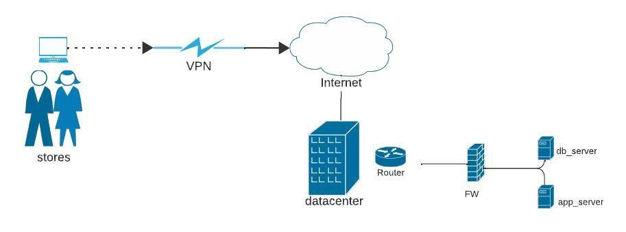

Project Workshop No. 18

  <a href="#Challenge">The challenge</a>&nbsp;&nbsp;&nbsp;|&nbsp;&nbsp;&nbsp;
  <a href="#Current Architecture">Current architecture</a>&nbsp;&nbsp;&nbsp;|&nbsp;&nbsp;&nbsp;
  <a href="#OddoModulos">Oddo Modules</a>&nbsp;&nbsp;&nbsp;|&nbsp;&nbsp;&nbsp;
  <a href="#Issues">Issues</a>&nbsp;&nbsp;&nbsp;|&nbsp;&nbsp;&nbsp;
  <a href="#ItemsTo BeEvaluated">Items to be evaluated</a>&nbsp;&nbsp;&nbsp;|&nbsp;&nbsp;&nbsp;
  <a href="#ProjectAdministration">Project Administration</a>&nbsp;&nbsp;&nbsp;|&nbsp;&nbsp;&nbsp;
  <a href="#Technologies">Technologies</a>&nbsp;&nbsp;&nbsp;|&nbsp;&nbsp;&nbsp;
  <a href="#Contributors">Contributors</a>&nbsp;&nbsp;&nbsp;|&nbsp;&nbsp;&nbsp;
  <a href="#memo-license">License</a>

## 🚀 THE CHALLENGE

The Magazine Upper plans to migrate its Odoo ERP from an on-premise environment to the Cloud. A big question is which Cloud is the best used and why?

The company is currently facing availability issues due to power outages in its data centre and storage issues due to data growth. The quote for a new storage disk is around R$ 50.000,00

## 🎲 CURRENT ARCHITECTURE

- The application is running on two virtual servers

- Database:
  - 16 vCPUs + 32 GB RAM
  - PostgreSQL database with 100 GB of storage

- Application:
  - 16 vCPUs + 32 GB RAM
  - Application data taking up 400 GB of storage

- 600 users distributed across 30 stores
- 5 stores are in shopping malls
- All stores communicate via VPN

### 🎲 ODDO MODULES
- E-commerce
- Point of sale
- Shopping
- Sales
- Financial
- Employees
- Help Center
- Messages
- Dashboard

## 🎲 ISSUES
- Availability
  - Power outages in the data centre affect availability
of the system
- Storage:
  - Data growth is beyond the capacity of current hardware

## 📝 ITEMS TO BE EVALUATED
[ ] Presentation - business vision 
[ ] Presentation - technical details 
[ ] Architecture 
[ ] Monitoring Panel with Notification (discord, telegram, WhatsApp, email, SMS) 
[ ] Documentation 
[ ] Tests 
[ ] Participation of group members 
[ ] Demo 
[ ] Deploy 

## 📝 PROJECT ADMINISTRATION
The project was divided into activities and managed using Kanban and Discord for communication and meetings.

## 🛠 TECHNOLOGIES
We used the following technologies  to support the solution:
- Terraform
- Oddo
- PostgreSQL
- Docker
- AWS
- AWS Services (Route53, Load Balancing, AutoScaling, Code Build)

## ✅ CONTRIBUTORS

<table>
  <tr>
    <td align="center"><a href="https://www.linkedin.com/in/victor-cleber/?locale=en_US"> <b>Victor Cleber</b></a> </td>
    <td align="center"><a href="https://www.linkedin.com/in/victor-cleber/?locale=en_US"> <b>Victor Cleber</b></a> </td>

  </tr>
  <tr>
     <td align="center"><a href="https://www.linkedin.com/in/victor-cleber/?locale=en_US"> <b>Victor Cleber</b></a> </td>
      <td align="center"><a href="https://www.linkedin.com/in/victor-cleber/?locale=en_US"> <b>Victor Cleber</b></a> </td>
  </tr>
</table>

Happy project 😊

##  🔗 LICENSE

 
This project is under the GNU General Public License v3.0. See more details in [LICENSE](./LICENSE) for more information.
